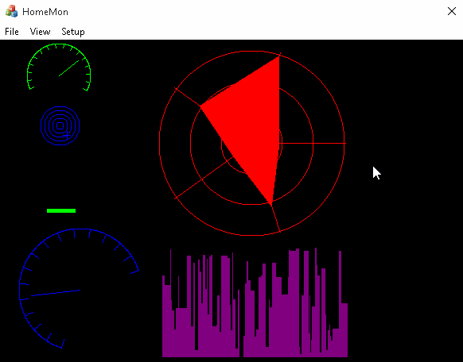

HomeMon
=======

The HomeMon project will be a simple domotic wireless sensor network for monitoring various parameter at home (like temperature, humidity, air quality, ambiental light, water tank level, etc.).
The nodes will communicate with each other, routing the measured parameters to a sink node.

This C++ application connects to a HomeMon sink node and displays the received data graphically.

 

 

 

Features
--------

* The application uses an object-oriented version of the [Dashboard graphics library](https://github.com/HashakGik/Dashboard-library-C)
* Controls can be created and destroyed at runtime, and placed on screen with a simple drag and drop mechanism
* The received data can be logged on file and a screenshot can be saved at any time
* The application reads from any serial port (either physical or virtual, e.g. a bluetooth adapter) update strings in the form `variable value\r\n` (with value being an integer between 0 and 255), without needing to declare variables beforehand (it will be possible to connect new nodes measuring new values to the network at runtime)
* The values are displayed asynchronously from the update strings (the screen refresh rate can be configured)
* The application state (including fullscreen mode or window size) is saved and restored between each execution, so the attached controls are not lost after a restart
* Since the application uses the Microsoft Foundation Classes, it will also work on a cheap Windows XP machine.

Remarks
-------

* The source comments are minimal
* The nodes for this project are not ready yet. The [HomeMon node emulator script](https://github.com/HashakGik/HomeMon-Node-Emulator-Ruby) can be used instead.